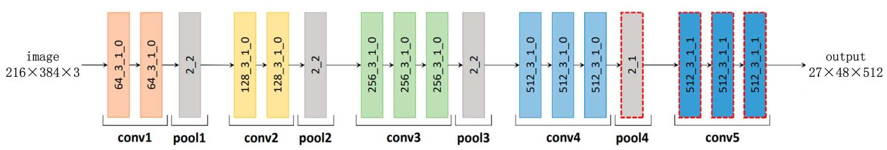
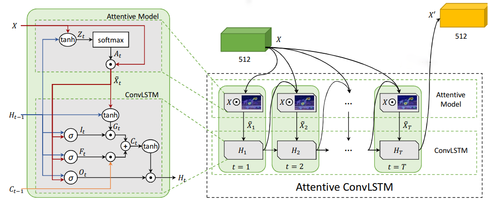
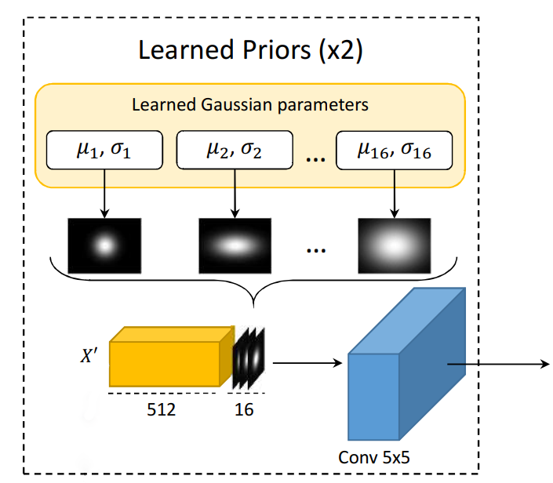
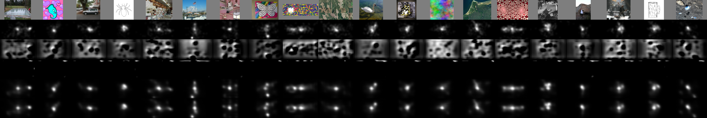

# Eye-Fixation-Detection
**SAM Model For Human Eye Fixation Detection**

For this dataset, there are 1600 images in the training set, 400 images in the test set. 20 types of training data, 80 for each type of data; 20 types of test data, 20 for each type of data. And the original image size is $1080 \times 1920$.

The dataset can be downloaded from the following link：

```python
链接: https://pan.baidu.com/s/141pFLmurCyD2XWFB6ddjSg 提取码: xpb8 复制这段内容后打开百度网盘手机App，操作更方便哦
```

The code running environment is as follows:

```python
Server Configuration: Intel Xeon CPU E5-2683 v3/28 kernels
RAM: 348G
Graphics Card: Nvidia Tesla P100/16G video memory
Operating System: Windows server 2012
Deep Learning Framework: Tensorflow 2.3
```

Considering limited computing resources, the image is scaled to $216\times384$.

The entire model combines DCN-VGG, ConvLSTM, and Gaussian Prior networks. The output of the previous network is used as the input of the next network, and at the end, the output of the Gaussian Prior network is subjected to single-channel convolution, upsampling and normalization to obtain the final result , which constitutes the complete SAM model.

- The DCN-VGG network is as follows:

  
- The ConvLSTM network is as follows:

  

- The Gaussian Prior network is as follows:

  

Through these three-level networks, the entire network is finally formed as follows:


When running the program on the server, the amount of parameters for the entire network is


For the SAM model, the evaluation index no longer simply selects the KL divergence or the Pearson coefficient CC, but forms the loss function of the SAM model through the linear combination of KLD and CC.

- CC (Correlation Coefficient Loss) evaluates the correlation between the predicted saliency map and the actual saliency map through covariance and variance. The specific formula is:
  $$
  {L_1}\left( {\tilde y,{y^{{\mathop{\rm den}\nolimits} }}} \right) = {{\sigma \left( {\tilde y,{y^{den}}} \right)} \over {\sigma (\tilde y) \cdot \sigma \left( {{y^{den}}} \right)}}
  $$

- KLD (Kullback-Leibler divergence) is mainly used to evaluate the approximation degree of two distribution functions. Its specific formula is:
  $$
  {L_2}\left( {\tilde y,{y^{{\rm{den }}}}} \right) = \sum\limits_i {y_i^{{\rm{den }}}} \log \left( {{{y_i^{{\rm{den }}}} \over {{{\tilde y}_i} + \varepsilon }} + \varepsilon } \right)
  $$

The final evaluation index is:
$$
L\left( {\tilde y,{y^{{\rm{den }}}}} \right){\rm{ = }}\beta {L_1}\left( {\tilde y,{y^{{\rm{den }}}}} \right) + \gamma {L_2}\left( {\tilde y,{y^{{\rm{den }}}}} \right)
$$
Loss, CC, KLD curves of the final training set are as follows:


Loss, CC, KLD curves of the final validation set are as follows:


According to the training results, load the optimal model saved when the epoch is 26 for the test set, and the final test results of each category are shown in the table

|   Metric\Category   |      Action       | Affective  |     Art      |     BlackWhite     |      Cartoon       |
| :-----------------: | :---------------: | :--------: | :----------: | :----------------: | :----------------: |
|         KLD         |      0.4021       |   0.4289   |    0.3998    |       0.3936       |       0.3363       |
|         CC          |      0.7959       |   0.8061   |    0.7977    |       0.8157       |       0.8303       |
| **Metric\Category** |    **Fractal**    | **Indoor** | **Inverted** |    **Jumbled**     |  **LineDrawing**   |
|         KLD         |      0.3975       |   0.3729   |    0.3704    |       0.3544       |       0.3168       |
|         CC          |      0.8218       |   0.8328   |    0.8361    |       0.8207       |       0.8679       |
| **Metric\Category** | **LowResolution** | **Noisy**  |  **Object**  | **OutdoorManMade** | **OutdoorNatural** |
|         KLD         |      0.3131       |   0.3869   |    0.3231    |       0.3979       |       0.3809       |
|         CC          |      0.8891       |   0.8509   |    0.8571    |       0.8083       |       0.8197       |
| **Metric\Category** |    **Pattern**    | **Random** | **Satelite** |     **Sketch**     |     **Social**     |
|         KLD         |      0.3323       |   0.3656   |    0.3654    |       0.2591       |       0.4343       |
|         CC          |      0.8698       |   0.8414   |    0.8500    |       0.8916       |       0.7853       |

The output images of 26th round of training are shown in figure as follows, where each row represents the original RGB image, the real saliency map, the single-channel convolution normalized DCN-VGG output, and the single-channel convolution normalized ConvLSTM output in turn , Single-channel convolution normalizes the Gaussian Prior output and the final prediction output; each column represents a set of image data.



The above is the main content of SAM model for human eye fixation detection, mainly a reproduction of the reference, details can be found in this reference. More content can be viewed in the pdf "Test Report.pdf".


### References:

[1].  M. Cornia, L. Baraldi, G. Serra and R. Cucchiara, "Predicting Human Eye Fixations via an LSTM-Based Saliency Attentive Model," in IEEE Transactions on Image Processing, vol. 27, no. 10, pp. 5142-5154, Oct. 2018, doi: 10.1109/TIP.2018.2851672.

